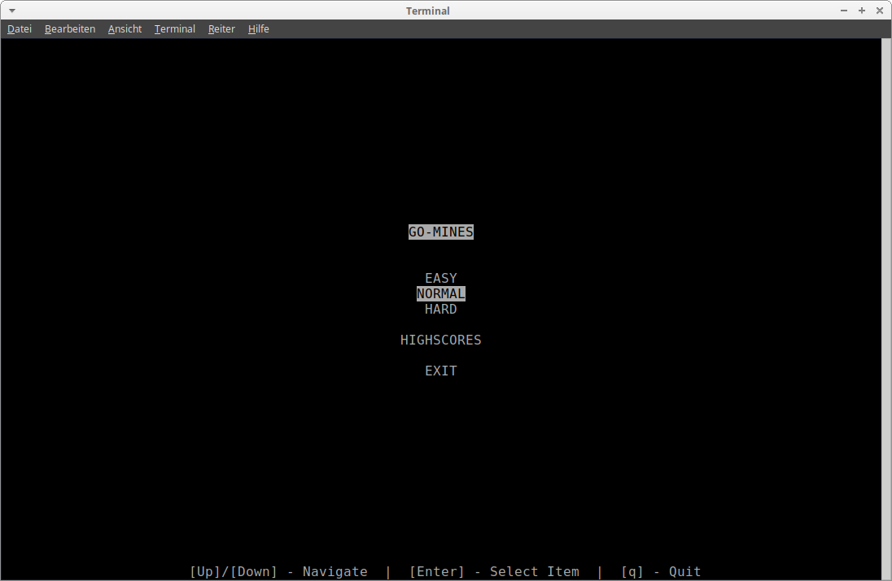
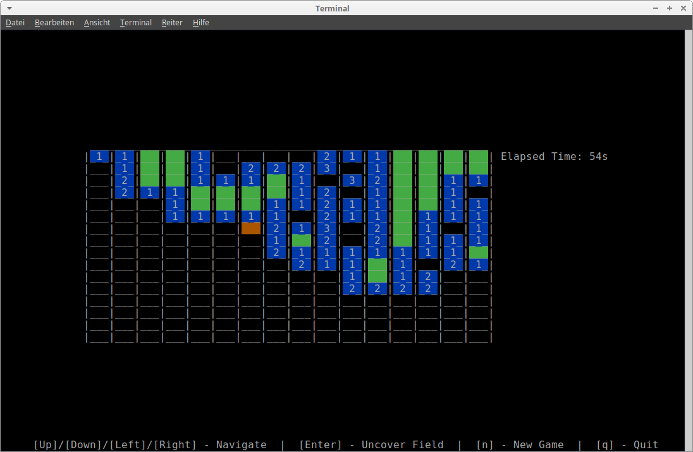
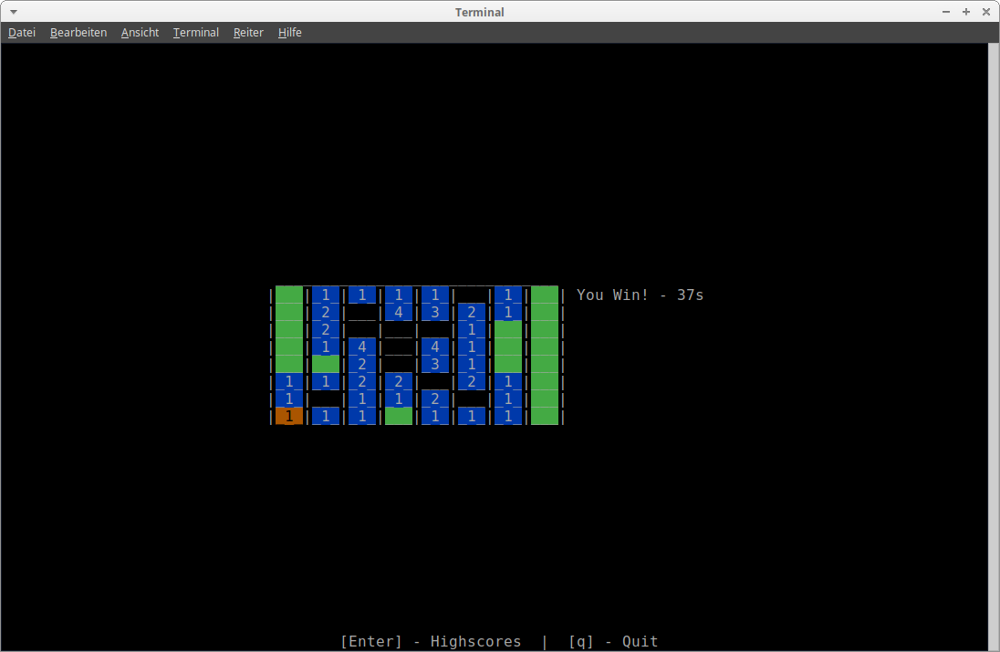
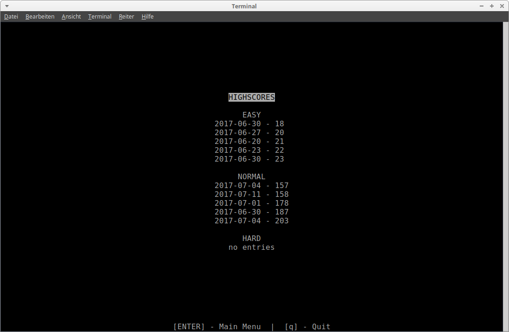
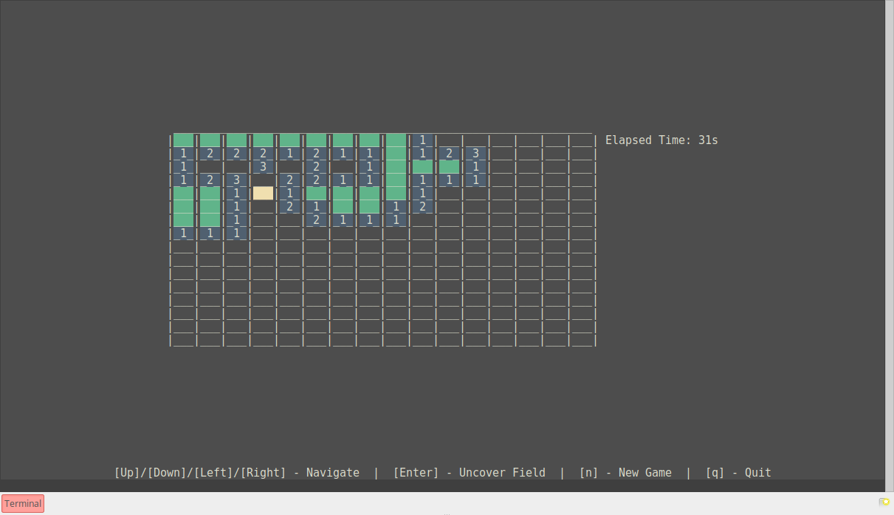

# go-mines
Just another minesweeper clone written in GO

Installation
------------
    go get -u github.com/smonecke/go-mines

Usage
-----
    ${GOPATH}/bin/go-mines
    
Screenshots
-----------
This project uses [termbox-go](https://github.com/nsf/termbox-go) to create the ui and to handle keyboard events. That's why there is only a limited number of available colors. It is not pretty but it's compatible with every terminal.

I like to play in the [guake](https://github.com/Guake/guake) terminal with the Zenburn color theme.

Highscores
----------
For each mode the five best results are stored. If you want to deceive youself you can find the highscore file in the directory .go-mines in your home directory. 

TODO
----
- [ ] Refactor. Some packages are confusing...
- [ ] Add flags!? Never used them...

License
-------
Copyright © 2017 Simon Monecke

Distributed under MIT License
